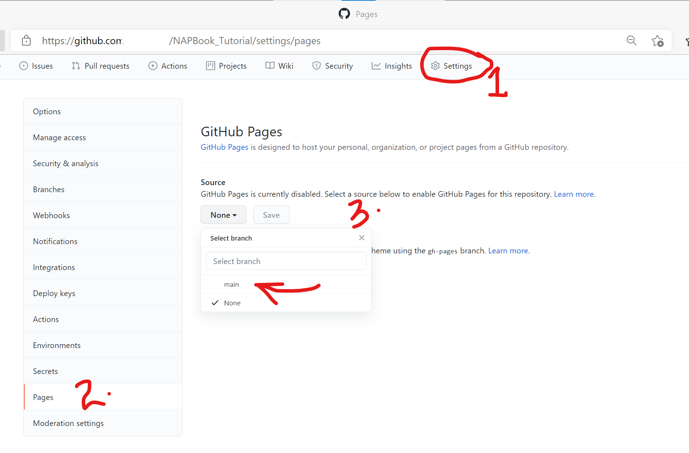

# GitHub & GitHub Pages
Github is great for project collaboration, backup and version control.
To use github as your repository manager, Create an account at (https://github.com/). 

## Sharing Repositories on GitHub
### Via GitHub Desktop
1. Open GitHub desktop on your pc/laptop  
2. On the main menu, click on `File` and select `Add local repository` from the dropdown list  
    
3. Browse to your your repository is sitting in your pc, select it and click `Add Repository'
4. A list of all your files and sub-directories appears from which you may select and deselect what you want to publish to GitHub.
5. Enter a commit message on the 'Summary' text-box right below your listed files and optionally a brief description.  
    
6. Hit 'Commit to master'
7. To the right of the GitHub desktop window, the app will notify you that this repository is only available on your local machine and if you would like to share/publish it to GitHub. Click on publish repository   
    
8. Uncheck the box for ‘keep the code private’ and Click `Publish repository`  
   

9. From the menu bar on GitHub desktop, click on `Repository` and select `Push` from the drop-down list.
10. Congratulations, you just published your repository to GitHub  

### Via direct file upload

1. Log in to your GitHub.com account 
2. Click on the plus sign + located at the top right corner of your github account page. 

  
3. Click on 'New Repository' from the drop-down menu.  
4. On the new window that appears, give the repository a name: NAPBook_Tutorial  
5. Leave the repository as 'Public' 
6. Leave everything else as is   
7. Scroll down and click on 'Create Repository'  
8. On the resulting window, click on 'upload an existing file' 

This will take you to a new window, from which you can drag-&-drop or browse to your files.   

9. Click on 'choose your files'.  
10. Navigate with the file explorer to where we saved our 'NAPBook_tutorial' folder in your pc.  
11. Select everything within this folder, and click 'Open'.  
Your files will start loading. Give it a minute or so.  
If you scroll through the files you will notice that our 'docs' folder is missing. Do not worry!  
12. To add the folder, lets use the drag and drop method. From your file explorer, navigate to our NAPBook_tutorial folder, and click once on the 'docs' folder to select it.  
13. Drag and drop this folder into your github repository. The files should start uploading.       
14. After your files finish uploading, scroll down to the 'Commit changes' field; here you may enter a short description for your files. Let's enter the text 'our first NAP book commit'  
When making changes to your files, you may use this field to briefly describe what changes you made, otherwise commonly known as commits.  
6. Next, hit the 'Commit changes' button at the end. This is called commiting.  

### Via Git Bash  

1. Download and install Git Bash from this link (https://git-scm.com/downloads).  
2. Repeat steps 1 - 7 in the preceding section.  
3. On the new window, click on the 'https' tab to reveal the url for your repository.   

4. Luanch Git Bash on your pc. This opens up a window with your pc name in the text. This is the command window.  
5. Set the working repository to where your project files are located. To do this, type in commamd `cd "path to your project files directory`. Click Enter on your keyboard.  
6. Type in `git init` to initialize this directory as your file origin.  
7. Type in `git remote add origin` the paste the https link from step 4. Click Enter.  
8. Type in `git add .` to add all project files in your pc to your github repository.  
9. To add only specific file, type in `git add .insert name of file`  
10. Type in `git commit -m`, open quotation marks and insert a commit message. Click Enter.  
10. Type in `git push origin master` and click Enter. This pushes/uploads your files plus the commit message to your github repo.   
Below is a list of the above commands  

    

__Congratulation once again!__   

To share your repository with colleagues and friends, just copy the link on your browser and share it with them. The link should take a similar identity as below;  

> https://github.com/yourusername/NAPBook_Tutorial

## Publishing to GitHub pages
Github pages helps you to create/publish websites in very simple steps.
We will publish the NAP book we just created with bookdown into a git-based website.
To do this,  
1.In your github repository, click on the `Settings` tab (right side of your screen)  
2. Scroll down the listed menu items on the left side of the screen until you find menu item `Pages`. Click on it.  

  
3. Scroll down to the 'Source' field. Click on the drop-down arrow and select the __main/master__ branch and __docs__ folder as your source files for your website. Click Save.   
A message with a link to your website will appear, right above the `Source` field.

> Your site is ready to be published at https://yourusername.github.io/repositoryname/

or as seen here: 
  

Use this link to view your newly created website.   
4. Alternatively, navigate back to your main repository area, scroll down to your right to find your active `github-pages`. Click to view your website deployments.  

   

__Now give yourself a pat on the back!__

