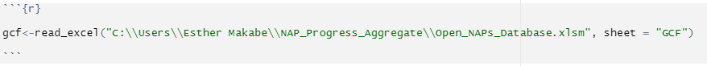
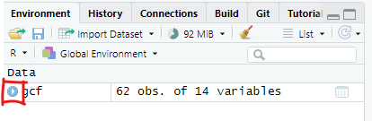
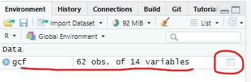
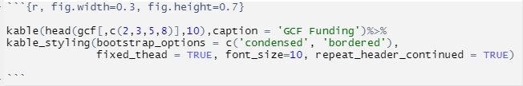

# Working Excel data


## Prep
Steps;  

### Install packages

```{r}
#install.packages(c("readxl", "magrittr", "knitr", "kableExtra", "DT", "plotly", "dplyr", "ggplot2", "treemapify"))
```

### Call libraries for the installed packages

```{r}
library(readxl)
library(magrittr)
library(knitr)
library(kableExtra)
library(DT)
library(plotly)
library(dplyr)
library(ggplot2)
library(treemapify)
```
### Import excel table from local drive       
To load and use excel data from local storage such as your pc, follow the following steps    

1.	Create an object by typing in a name for the data you want to upload followed by the greater than sign and a hyphen/dash (<-).My object below is called 'gcf'
2.  Call the library function `read_excel` or `read_csv` in case your data is stored in csv format   
2.	Inside the parenthesis, open single or double quotation marks `" "` or `''` , enter the path to your excel file (you may copy and paste this form your file explorer address bar). Be sure to include the full name of your file including the format extension (.xls, .xlsx, .csv, etc)    
4. The backslash in markdown is a special character, therefore to avoid associated errors, add another backslash to each existing backslash in your path.   
5.	Specify the sheet name or number in case your excel data has multiple sheets, otherwise skip this step  
see screenshot below for all the steps above.  



```{r}

gcf<-read_excel("C:\\Users\\Makabe\\NAP_Progress_Aggregate\\Open_NAPs_Database.xlsm", sheet = "GCF")

```

6.	Run code  
7. Your data object appears in the environment window  
8.	To view your data attributes and structure, click on the 'play' icon  



9.	To view your data, click on the data object or table sign on the far right of your data set/object name




## Build Tables
### Static table  
1.	Open a new code chunk
4.	Call the `kable` function by typing in 'kable()' # auto fill is your friend
6.  Fill in details as below ( since we are only plotting the first 10 rows of our table, we will add another argument called `head' and specify we want to only plot columns 2,3,5,and 8 and only the first 10 rows)  



Hover over the function to see parameters required or go to the 'Help' tab and search 'datatable' to see further details on its application.

```{r, fig.width=0.1, fig.height=0.7}

kable(head(gcf[,c(2,3,5,8)],5),caption = 'GCF Funding')%>%
kable_styling(bootstrap_options = c('condensed', 'bordered'),
              fixed_thead = TRUE, font_size=10, repeat_header_continued = TRUE, full_width = F)%>%
  column_spec(1:4, width = "10em")

```
### Interactive table 

1.	Open a new code chunk 
2.	Install packages DT and magrittr
3.	Load their libraries  
4.	Call `datatable` function by typing in 'datatable()' # auto fill is your friend
5.	Hover over the function to see parameters required or go to the 'Help' tab and search 'datatable' to see further details on its application.
6.  Fill in details as below  
```{r, warning=FALSE,message=FALSE, fig.dim=c(1,0.5)}


gcf_columns<-gcf[,c(2,3,5,8)] # selects only the columns we want to see in our table
datatable(gcf_columns,filter = 'top',rownames = F, editable = F, style = 'jqueryui', class = 'display responsive', width = '100%', caption = "GCF Project Funding", extensions = 'Buttons', options=list(pageLength= 5, dom='lfrtipB', buttons = c('copy', 'csv', 'excel', 'pdf')))%>%
  DT::formatStyle(columns = colnames(gcf_columns),fontSize= '10px')

```

## Generate Other Graphics   
### A bar chart       
1.	Open a new code chunk
2.	Install packages plotly & dplyr
3.	Call their respective libraries
4.	To plot the no of projects per region, first group your data by region, then count the no of projects (use a unique identifier, in our case the project ID)
5.	Call the function 'plot_ly' and enter parameters as in below

```{r fig.width=8, fig.height=5}

gcf %>% group_by(Region)%>% count(gcf$`Project Name`)%>%
  summarise("Projects"=sum(n))%>%   plot_ly(type = "bar", 
          y = ~Projects,  x = ~Region
          
               ) %>%
plotly::layout(yaxis=list(title='No. of Projects',tickfont=list(size=12)),
                 xaxis=list(title='Region', tickfont=list(size=12)))

```
 
### A donut chart 
To plot the same data as above but on a pie chart, the process the same, only the type of chart changes
```{r, fig.width=8, fig.height=8}

gcf%>%group_by(Region)%>%summarise('Total'=sum(`Total GCF Funding`))%>%plot_ly(labels=~Region, values=~Total,sep = '\n')%>% add_pie(hole=0.5)%>%
    layout(title="GCF Funding by Region")

```

## Filter and plot select data        
### Pie chart         
To plot projects for a select region (s), use the filter function to select only values that match your selection, then group the data by country and create count by unique identifier as above. Repeat the plotting steps as above. you may use any type of charts as may be preferred.

```{r,fig.width=8, fig.height=8}

gcf%>%filter(Region=="Asia-Pacific")%>%
  group_by(countryname)%>%count(`Project Name`)%>%
        plot_ly(labels=~countryname, values=~n)%>%
    add_pie()%>%
    layout(title=" GCF Projects in Asia-Pacific",
           legend=list(orientation='h'))

```

### Build Treemap       
#### Static       
1.	Open a new code chunk
2.	Install packages ggplot2 & treemapify
3.	Call the respective libraries
4.	To plot amount of grant in Region x, filter values for only that region,
then summarise the data by country using the functions 'group-by' and 'sum' 
5. Call the function 'ggplot' and enter parameters as shown in screenshot above
6. Run code 

```{r}

ggplot(gcf, aes(fill=countryname, 
       area=gcf$`Total GCF Funding`, 
       label = paste(countryname,"\n",prettyNum(`Total GCF Funding`,
                                                big.mark = ","))))+
  geom_treemap()+
  geom_treemap_text(colour='black', place='centre')+
  labs(subtitle = 'GCF Funding in Latin America & Caribbean')+
  theme(legend.position = 'none')

```

#### Interactive            
```{r}

gcf_sum<-gcf%>%filter(Region=="Africa")%>%
  group_by(countryname, Region)%>%summarise("Total"=sum(`Total GCF Funding`))

plot_ly(
  data = gcf_sum,
  type= "treemap",
  values = ~Total,
  labels= ~countryname,
  parents= ~Region,
  name = "GCF Funding",
  textinfo="label+value+percent parent")


```
