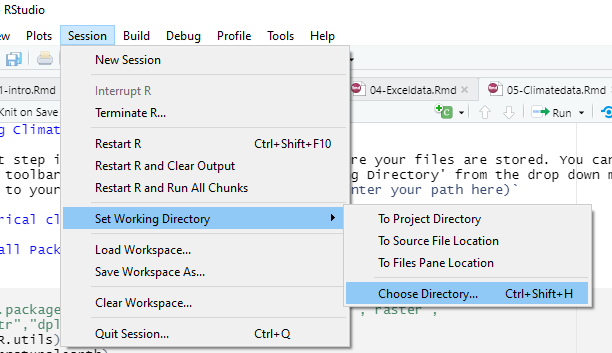

# Working Climate data

The first step is to set your working directory, where your files are stored. You can do this from the toolbar tab session, and choose 'Set Working Directory' from the drop down menu, and navigate to your folder. 




Or use the command `setwd(enter your path here)`


## Historical climate data

### Install Packages and load libraries


```{r}
#install.packages("R.utils","rnaturalearth","reshape","raster",
#"magrittr","dplyr","lubridate")
library(R.utils)
library(rnaturalearth)
library(reshape)
library(raster)
library(magrittr)
library(dplyr)
library(lubridate)
```

### Load data from cru website

1. On your browser, navigate to (https://crudata.uea.ac.uk/cru/data/hrg/cru_ts_4.05/cruts.2103051243.v4.05/). This is where all data variables are stored. 
2. Select the variable of your choice. In the example below, we will use precipitation and mean temperature data, variable names 'pre' & 'tmp' respectively. 
3. On the data folder, find data for the years 1901-2020 
(cru_ts4.05.1901.2020.pre.dat.nc.gz/ru_ts4.05.1901.2020.tmp.dat.nc.gz). 
4. Right click on it and copy link address. Open a code chunk and paste your link in an object( as in 'myurl' in below code).
5. Call the function `download.file` and enter details as below.
6. The files are stored as a compressed .gz file, to extract the files, call the function `gunzip` and enter file name with the .gz extension
7. Run code


```{r, cache=TRUE, warning=FALSE, message=FALSE}

# precipitation
#preurl<- "https://crudata.uea.ac.uk/cru/data/hrg/cru_ts_4.05/
#cruts.2103051243.v4.05/pre/cru_ts4.05.1901.2020.pre.dat.nc.gz"
#download.file(preurl, destfile="cru_ts4.05.1901.2020.pre.dat.nc.gz")
#gunzip("cru_ts4.05.1901.2020.pre.dat.nc.gz")

# temperature
#tmpurl<- "https://crudata.uea.ac.uk/cru/data/hrg/cru_ts_4.05/
#cruts.2103051243.v4.05/tmp/cru_ts4.05.1901.2020.tmp.dat.nc.gz"
#download.file(tmpurl, destfile="cru_ts4.05.1901.2020.tmp.dat.nc.gz")
#gunzip("cru_ts4.05.1901.2020.tmp.dat.nc.gz")
```

### Load/define geometry
This is where data to define your area of interest goes.
You may upload your own geometry,such as shapefile or use any of the map services available in r. In this case we will use country boundaries from the package `rnaturalearth`

```{r, warning=FALSE, message=FALSE}
malawi<-rnaturalearth::ne_countries(country ='malawi')
```

### Load/Import your data into r
Create new object name and call the raster function `stack`
Enter the path to your data directory/ where you saved the downloaded file.
To extract data exactly to your desired area on interest, use the raster functions `crop` and `mask` and the bounding geometry (in our case the Malawi national boundary)

```{r}

prstack<-stack("C:\\Users\\Makabe\\NAPdown\\cru_ts4.05.1901.2020.pre.dat.nc")
temp<-stack("C:\\Users\\Makabe\\NAPdown\\cru_ts4.05.1901.2020.tmp.dat.nc")

pr_crop<-raster::crop(prstack, malawi) # cut out data for malawi
pr_mask<-raster::mask(pr_crop,malawi) # mask data to malawi boundary

tcrop<-raster::crop(temp, malawi)
tmask<-raster::mask(tcrop, malawi)

```

At this point you can already plot individual precipitation and temperature layers using the basic plot function. Below we plot precipitation and temperature  for October 2011

```{r, message=FALSE, warning=FALSE}
par(mfrow=c(1,2))
pr<-plot(prstack$X2011.10.16, main='Precipitation')
t<-plot(temp$X2011.10.16, main='Temperature')
show(pr)
show(t)
```


### Convert the raster stack created above into a dataframe and format date values
This step extracts raster values at each station (depicted by its latitude and longitude) and stores them as a table.  
The `melt` function converts the data from a wide to long table format.     
The date values in our data are stored as and within text and the step below is to extract the dates from this text and store them in a new column.     
We also, create two more columns to separate Year and Month  

__Caution!: The process in this code chunk involves modifying the data structure and thus extra attention is required. If you need to run the code or part of it more than once, it is strongly recommended to run the whole code chunk rather than in parts.This is to avoid duplication and conflict in executing commands.__ 

```{r, warning=FALSE, message=FALSE}

prdf<-as.data.frame(pr_mask, xy=TRUE, na.rm=TRUE)%>%
  melt(id.vars=c('x','y')) # create dataframe
tmpdf<-as.data.frame(tmask, xy=TRUE, na.rm=TRUE)%>%
  melt(id.vars=c('x', 'y'))

Date<-substr(prdf$variable, 2,11) # extract date values from the dataframe
prdf$Date<-Date # add date column to dataframe
Year<-substr(Date,1,4)
Month<-substr(Date,6,7)
prdf<-cbind(prdf, Year, Month)

colnames(prdf)[colnames(prdf)=="value"]<-"pr"  # change column label


tmpdf$Date<-substr(tmpdf$variable, 2,11) 
tmpdf$Year<-substr(tmpdf$Date,1,4)
tmpdf$Month<-substr(tmpdf$Date,6,7)

colnames(tmpdf)[colnames(tmpdf)=="value"]<-"tmean" 

```

### Plot Monthly data
Our data is now ready for some statistical analysis.
we may plot monthly data as below;

```{r, warning=FALSE, message=FALSE, fig.dim=c(10,10)}
# summarise data by month and calculate monthly mean
pr_monthly<-prdf%>%dplyr::filter(Year>=1981)%>% group_by(Month)%>%
  summarise(across(contains("pr"), ~mean(pr))) 

# rearrange drawing order to plot from July to June
pr_monthly$Month<-factor(pr_monthly$Month,
                         levels =c('07','08','09','10','11','12',
                                   '01','02','03','04','05','06'))


temp_monthly<-tmpdf%>%dplyr::filter(Year>=1981)%>%group_by(Month)%>%
  summarise('tmean'=mean(tmean))
temp_monthly$Month<-factor(temp_monthly$Month, 
                           levels = c('07','08','09','10','11','12',
                                      '01','02','03','04','05','06'))

# combine the pr and temp data frames 
pr_tmp<-cbind(pr_monthly,temp_monthly) 
pr_tmp<-pr_tmp[,-3] # remove duplicate column

pr_tmp$Month<-month.abb
pr_tmp$Month<-factor(pr_tmp$Month, 
                     levels = c("Jul","Aug","Sep","Oct","Nov", 
                                "Dec","Jan","Feb","Mar","Apr","May" ,"Jun"))
 
# define properties for secondary axis (only when plotting 2 variables 
#in the same plot area)
ty<-list(overlaying = "y",
  side = "right",
  title = "Temperature (°C)",
  autotick = FALSE,
      dtick = 8,
 range=c(15,30)
  )

# plot 
plot_ly(type= 'bar', data= pr_tmp, x= ~Month, y= ~pr, name = 'Precipitation')%>%
 add_lines(x= ~Month, y= ~tmean,name= 'Temperature', yaxis='y2')%>%
  add_markers(x= ~Month,y= ~tmean,color='#D21919',yaxis='y2', name='Temperature', 
              showlegend=FALSE)%>%
    layout(legend=list(orientation='h', y=-0.13,x=0.65), 
           yaxis=list(title='Precipitation (mm)',showticklables=F,
                      tickfont=list(size=16)),width=700, height=450, 
           title='Malawi \n (Mean 1981-2020)', yaxis2=ty)%>%
  subplot(titleX = TRUE, titleY = TRUE)
```

### Plot Annual data
or the annual means as below;  

+ Subset the data to get only values from 1981 on wards (or whichever year is preferred)
+ Then, group the data by years
+ Calculate mean values for each year
+ Combine the data frames
+ Plot time series object


```{r, warning=FALSE, message=FALSE}

pr_ann<-prdf%>%dplyr::filter(Year>=1981)%>% group_by(Year)%>%
  summarise(across(contains("pr"), ~mean(pr))) 


temp_ann<-tmpdf%>%dplyr::filter(Year>=1981)%>%group_by(Year)%>%
  summarise('tmean'=mean(tmean))

# combine the pr and temp data frames
pr.tmp<-cbind(pr_ann,temp_ann) 
pr.tmp<-pr.tmp[,-3] # remove duplicate column

# define properties for secondary axis
ty<-list(overlaying = "y",
  side = "right",
  title = "Temperature (°C)",
  autotick = FALSE,
      dtick = 1,
  showgrid=F,
 range=c(20,25)
  )

# plot 
plot_ly(type= 'bar', data= pr.tmp, x= ~Year, y= ~pr, name = 'Precipitation')%>%
 add_lines(x= ~Year, y= ~tmean, mode = 'lines+markers',name= 'Temperature',
           yaxis='y2')%>%
    layout(legend=list(orientation='h', y=-0.13,x=0.7), 
                   yaxis=list(title='Precipitation (mm)',
                              showticklables=F, tickfont=list(size=14)),width=700, 
           height=450, title='Malawi \n (Mean 1981-2020)', 
                   yaxis2=ty, xaxis=list(tickangle=270,tickfont=list(size=14)))


```


The two preceding plots are twin-plots, meaning two graphics have been combined in a single plot area. 
To plot just one you may be choose one of the data frames, say temperature, and plot it on its own. See below


```{r,warning=FALSE, message=FALSE}

temp_ann%>%filter(Year>2000)%>% plotly::plot_ly()%>%
 add_lines(x= ~Year, y= ~tmean, color='red', showlegend=FALSE)%>%
  add_markers(x= ~Year, y= ~tmean, color='red', showlegend=FALSE, 
              name='Temperature')%>%
  layout(yaxis=list(title='Mean Temerature (°C)',tickfont=list(size=16)),
         xaxis=list(tickangle=270,tickfont=list(size=16)))

```

