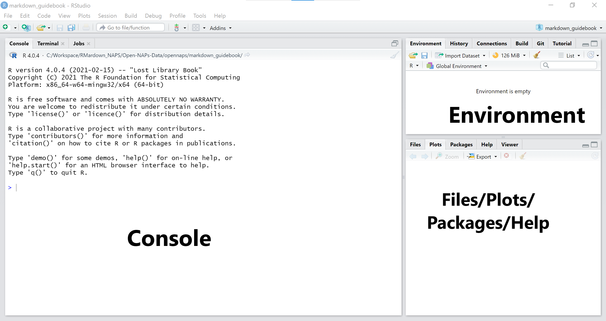
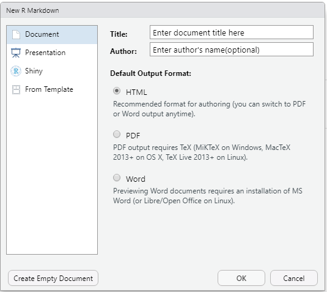
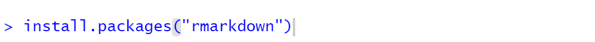
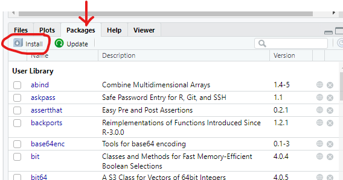

--- 
title: "An introduction to NAPdown"
author: "A Team"
date: "`r Sys.Date()`"
site: bookdown::bookdown_site
documentclass: book
bibliography: [book.bib, packages.bib]
url: https://napdown.github.io/NAPdown/
description: |
  This is an introduction to NAPdown.Chapter1 introduces you to the basics
  of R and RStudio, Chapter2 introduces napdown, a bookdown concept and Chapter3
  on sharing and collaboration with GitHub. The subsequent chapters go into detail
  about working with different types of data and data sources. 
  Additional chapters are provided further reading material and references.
link-citations: yes
github-repo: napdown/NAPdown
---

```{r setup, include=FALSE, fig.dim=c(6,3), fig.align='left'}
knitr::opts_chunk$set(echo = TRUE, warning=FALSE, message=FALSE)
options(knitr.duplicate.label = "allow")
```

# Prerequisites  
1. You have installed R (https://cran.microsoft.com/)
2. You have installed RStudio (https://www.rstudio.com/products/rstudio/download/)

The installation prompts for installing both r and rstudio are straight-forward.
However, should you require a step-by-step guide, you may refer to this [beginners guide](https://techvidvan.com/tutorials/install-r/)

## Opening a markdown file   
1. Launch your r/studio app. 
Your rstudio workspace should look more or less similar to this:  

   
If your rstudio opens up with 4 windows instead of 3, skip next step.  
2. From the main menu, go to File->>New File->>R Markdown.  
You should have a window like this:  
  
3. Fill in the details for your document title and author. Leave the rest as default.  
4. Click Ok.  
This opens up your 4th rstudio window with an rmarkdown script.  
Now your app area should look more or less like this;  
  

The arrangement may however be different. If so, do not worry, it's just semantics.  

_As you might have seen, you may open other scripts such as R, python, SQL etc in similar manner._

### Rstudio windows explained:   
* **The Source**  
This is your scripting area.   
You may write, edit and run your code from here.  

* **The Console**   
All processing in r happens here. You may this is the r kitchen.
When you run your code, this is where it is evaluated.  
You may also use the console to write and execute your code. However, you can not save your code, nor can you edit it (you will have to rewrite it). Thus, it is always advisable to write your code in the script/source area.  
* **The Environment**  
This panel holds your data objects and their metadata. As you create or add new objects into your project, they will appear in this window. You may view and remove objects.
It also contains the 'History' tab from which you may view all your r processing history.  
* **The Files/Plots/Packages/Help Panel**  
This panel provides a shortcut/alternative to different functions such as to access your project files, to view plots from your code evaluations, install packages and access the Help resource. You may add/remove items here but we will learn that much later. For now we leave it as is.

  
## Installing packages
Options:

__1. From the console;__  
After the greater than (>) sign, write command `install.packages("package name")` and hit enter on your keyboard.  
See example;

  

__2. In script window __ 
Inside your script write command `install.packages("package name")`   
Click on 'Run' (Run button is on the top right of your source panel).   
Alternatively, if your write your command in a code chunk, you may hit the 'Play' button on far right of your code chunk. See example;

   

*We see more about code chunks in the next chapter.   

__3. From the menu bar __ 
From the menu bar, go the the tab 'Tools' and select 'Install Packages'.  
You should see a window like this one:  

  

In the 'Install from' field, select 'Repository (CRAN)', then enter the name(s) of packages to be installed.  
Leave everything else as default. Click Install. 

__4. From Files/Plots/Packages/Help Panel__    
Click on the 'Packages' tab. There are 2 tabs under this, Install & Update.  
Click on Install.  



If the 'Install from' is not set to 'Repository (CRAN)', set it so, and enter name(s) of packages to be installed.  
Leave everything else as default. Click Install.


__Note:__ _Packages can only be installed once. To mean, if you close your r/rstudio app and come back to it the next day/session, you do not need to install the packages you already installed in your previous session. You will only need to load their libraries (see next section)_

### Removing/un-installing packages  
To remove a package use command `remove.packages("package name")`

## Loading Libraries
To be able to make use of the packages installed, you need to call their libraries. Most libraries take the name of the package. For instance, for the package `rmakdown`, the respective library is `rmarkdown`.To call the  rmarkdown library, use command `library(rmarkdown)`.
So in general to load/call libraries use command `library(name of library)`.  
You may load libraries in the console or in your script.

__Note:__ _Unlike packages,library functions expire when you close a project or end a session. Therefore, each time you open an r session, you have to load/call relevant libraries_


```{r include=FALSE}
# automatically create a bib database for R packages
knitr::write_bib(c(
  .packages(), 'bookdown', 'knitr', 'rmarkdown'
), 'packages.bib')
```


